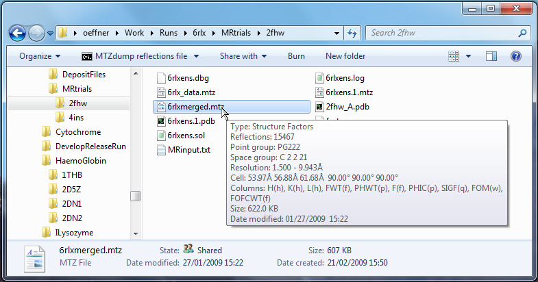

MtzExtInfoTip - a shell extension library for Windows Explorer
----------------------------------------------------------------

This library is mostly for the benefit of scientists working in macromolecular crystallography. 
The file format MTZ as defined by the CCP4 community contains header information about the data contained 
in each file such as unit cell dimensions, space group, name of columns etc. These can be displayed with command 
line programs such as MTZDUMP which works fine but is somewhat is cumbersome. The current library uses win32
API functions present in Microsoft Windows. When you install this library you can display the header information by 
hovering your mouse over an MTZ file in Windows Explorer as depicted below. 

To install place the library file, "x64\Release MinDependency\MtzExt.dll", somewhere on your PC and run 
the install.cmd file from a command line supplied with the location of the library and you're done. The 
script will prompt you for admin privileges if you are not an adminstrator. Current version is for 64 bit 
Windows. If you want a 32 bit version, build it yourself. Source code compiles on Visual Studio 2015 
and later compilers.
